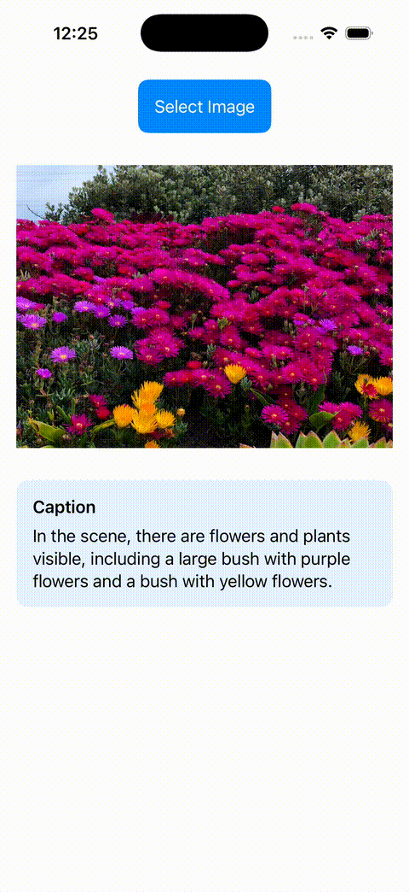

# On-Device Image Captioning


<p align="center">
  
</p>

Lightweight on-device image captioning system based on MobileVLM, supporting PyTorch, ONNX, and iOS deployment.

## Overview

This project implements an image captioning pipeline designed for deployment in resource-constrained environments.

- Supports multiple models: BLIP, InstructBLIP, and MobileVLM v2
- Supports PyTorch, ONNX, and Core ML deployment for MobileVLM v2

## Features

- Lightweight on-device image captioning
- MobileVLM v2 support
- PyTorch / ONNX / Core ML inference
- iOS deployment support
- Edge-device optimization

## Model Weights

### PyTorch

The following pretrained models from Hugging Face are used in this project:

- BLIP: "Salesforce/blip-image-captioning-base"
- InstructBLIP: "Salesforce/instructblip-flan-t5-xl"
- MobileVLM: "mtgv/MobileVLM_V2-1.7B"

### ONNX

Due to their large size (~6GB), ONNX model weights are not included in this repository.

Instead, you can generate them locally using the provided export script:

```bash
python src/mobilevlm/runtime/export/export_onnx/export_*.py
```

### Core ML

Due to their large size (~6GB), Core ML model weights are not included in this repository.

Instead, you can generate them locally using the provided export script:

```bash
python src/mobilevlm/runtime/export/export_coreml/export_*.py
```

## Running MobileVLM

### Common Setup

```bash
git clone https://github.com/kc-ml2/captioning_edgedevice
cd captioning_edgedevice

python3 -m venv venv
source venv/bin/activate

pip install --upgrade pip
pip install -r requirements.txt
```

### Quick Start with PyTorch

```bash
python src/mobilevlm/runtime/pytorch/pytorch_mobilevlm.py
```

### ONNX Deployment

Change version for dependencies:
```bash
pip install torch==2.0.1 torchvision==0.15.2 transformers==4.33.1 tokenizers==0.13.3 
```

Export ONNX weights:
```bash
python src/mobilevlm/runtime/export/export_onnx/export_vision_onnx.py
python src/mobilevlm/runtime/export/export_onnx/export_projector_onnx.py
python src/mobilevlm/runtime/export/export_onnx/export_tokenizer.py
python src/mobilevlm/runtime/export/export_onnx/export_embed_tokens_np.py
python src/mobilevlm/runtime/export/export_onnx/export_llm_onnx.py
```

We need only these weights related ONNX: 

'mm_projector.onnx' , 'mobilellama.onnx' , 'mobilellama.weights.bin' , 'vision_tower.onnx' , 'embed_tokens.npy' , 'tokenizer.model'

Run inference:
```bash
python src/mobilevlm/runtime/onnx/onnx_mobilevlm.py
```

### Core ML / iOS Deployment

You need macOS and Xcode to run the iOS application.

First, export the Core ML model weights:

```bash
python src/mobilevlm/runtime/export/export_coreml/export_vision_coreml.py
python src/mobilevlm/runtime/export/export_coreml/export_projector_coreml.py
python src/mobilevlm/runtime/export/export_coreml/export_embed_tokens_bin.py
python src/mobilevlm/runtime/export/export_coreml/export_llm_coreml.py
```

Second, open the iOS project in Xcode and add the following Swift Package dependencies:
- 'swift-argument-parser' (1.7.1)
- 'swift-sentencepiece' (0.0.6)

Third, add the following resources to your Xcode project:

- `captioning_edgedevice/src/mobilevlm/runtime/iOS/`
- Exported Core ML model weights

Finally, open the Xcode project and run it on an iOS device.


## Result

### Input 

`sample.jpg`

 

**Question:**  
"What objects are visible in the scene?"

### Generated Caption

"In the image, there is a living room with a fireplace, a television, a table, chairs, and a woman standing in the kitchen."


## Performance and Latency 

**Load Latency**  
The model server loads the model once at startup and performs an initial warm-up pass.

**VRAM Usage**  
GPU (NVIDIA TITAN V) memory usage is measured after the model is fully loaded and warmed up.

**Inference Latency**  
Image captioning latency per image is measured over 500 randomly sampled images from COCO val2017.

### Model Comparison

| Model        | Precision         | Load Latency | VRAM Usage | Inference Latency |
|--------------|-------------------|--------------|------------|-------------------|
| BLIP base    | FP16              | 5  s         | 0.9 GiB    | 0.6 s             |
| InstructBLIP | FP16              | 12 s         | 10.7 GiB   | 2.0 s             |
| InstructBLIP | Hybrid (INT4 LLM) | 15 s         | 6.9 GiB    | 2.7 s             |
| InstructBLIP | INT4              | 20 s         | 5.0 GiB    | 2.7 s             |

## MobileVLM CPU Runtime Breakdown

Latency breakdown for a single image inference.

> The current Xcode/Core ML implementation is not fully optimized.

| Runtime         | Preprocessing | Vision Encoder | Projector  | LLM (40 tkn)  | Total    |
|-----------------|---------------|----------------|------------|---------------|----------|
| GPU             | -             | -              | -          | -             | 1.7 sec  |
| CPU (Python)    | 0.04 sec      | 0.52 sec       | 0.01 sec   | 6.33 sec      | 6.90 sec |
| CPU (ONNX)      | 0.03 sec      | 0.88 sec       | 0.02 sec   | 3.77 sec      | 4.70 sec |
| iOS (Core ML) | 0.12 sec      | 1.27 sec       | 0.02 sec   | 6.10 sec      | 7.51 sec |


## Acknowledgement

This project is partially based on the official MobileVLM repository:
https://github.com/Meituan-AutoML/MobileVLM

We adapted and modified the original implementation for:
- PyTorch runtime
- ONNX deployment
- Core ML deployment
- On-device inference optimization


## License

Copyright (c) ML2.
All rights reserved.

This project includes code derived from the MobileVLM repository,
which is licensed under the Apache License 2.0.

The official PyTorch-based MobileVLM was modified and exported to ONNX and Core ML for on-device inference.
